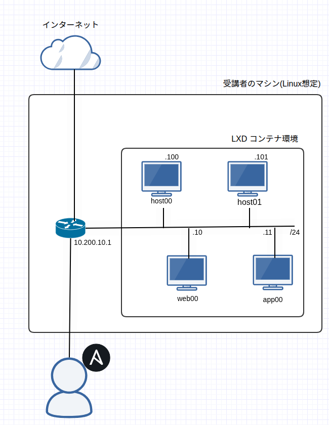

# Ansible Hands-On Materials

## Overview

このリポジトリは、IIJ Bootcamp の講義「[Ansible による IT 自動化](https://iij.github.io/bootcamp/cicd_infra/ansible/)」講義用教材です。

この講義では本リポジトリを使用して構築する環境を前提に演習を行うため、参加者の方々は以下の作業を実施し、必要な環境を揃えてください。

## Requirements

ハンズオンを実施する上では、以下のセットアップが前提となっています

- Ubuntu 24.04
  - IIJ 社内における Bootcamp 実施時の推奨環境が Ubuntu となっているため
  - これ以外での環境でも実施可能ですが、`/setup`下のスクリプトについては書き換えが必要です
- git
  - 導入されていない場合は事前に `sudo apt install git` などでインストールしておいてください
- lxd
  - Ansible 適用先ターゲットノードの構築のために使用します

## Caution

<!-- TODO: この項目は不要かも -->
このハンズオンの実行では、以下のような問題点があります。
演習の為に敢えて設定していますが、本来は好ましい設定ではないため、本番環境では適切な設定を行ってください

- rootユーザによるsshログインを許可している
- rootパスワードが安直な文字列になっている

## ToDo

それでは演習に必要な環境のセットアップを行います。
以下の一連の作業を実施すると、下記の図に示したような環境が構築されます。

LXD を使用して立ち上げる複数のコンテナを擬似的な Ansible 適用先のホストとし、手元環境を Ansible 実行元ホストとして使うイメージになります。



1. Hands-On Materialのダウンロード
   ```sh
   $ git clone https://github.com/iij/ansible-exercise.git
   $ cd ansible-exercise
   ```

1. ssh ログイン用公開鍵の登録

    演習環境のコンテナにログインするため、公開鍵を生成します。

    ```sh
    $ ssh-keygen -q -t ed25519 -N '' -f ~/.ssh/bootcamp_ansible_key
    ```

    生成した公開鍵を確認し、コピーします。（マウスで選択し Ctrl+Shift+C など）

    ```sh
    $ cat ~/.ssh/bootcamp_ansible_key.pub
    ## 表示された公開鍵をまるごとコピーしておく
    ```

    公開鍵生成後、以下のようにセットアップ用スクリプトに鍵を設定しておいてください。
    ./setup/lxd_scripts/setup_for_ansible.sh を以下のように編集します。

    このスクリプトは lxd コンテナにマウントされ、後の手順で使用します。
    ```sh
    #!/bin/bash

    BOOTCAMP_ANSIBLE_KEY='your-key' # この your-key をコピーした鍵で置き換えて保存
    ...
    ```

1. LXD コンテナインフラ環境のセットアップ

   ターゲットノード（Ansible の適用先環境）を自動で立ち上げるスクリプトを用意しています。
   以下のように実行してください。
   ```bash
    ## LXD のインストールとセットアップ
   $ ./setup/setup_lxd.sh
    ## LXD でのターゲットノードのセットアップ
   $ ./setup/setup_target_nodes.sh
   ```

1. コンテナ動作確認
   ```bash
   $ sudo lxc exec host00 -- bash
   ## root@host00:~# というプロンプトが表示されればOK
   ## Ctrl + C で抜ける
   ```
   ```bash
   $ ping 10.200.10.101
   ## 出力例
   PING 10.200.10.101 (10.200.10.101) 56(84) bytes of data.
   64 bytes from 10.200.10.101: icmp_seq=1 ttl=64 time=0.039 ms
   64 bytes from 10.200.10.101: icmp_seq=2 ttl=64 time=0.053 ms
   64 bytes from 10.200.10.101: icmp_seq=2 ttl=64 time=0.053 ms
   ...
   ```

1. ターゲットノードの初期構築

    ターゲットノードとなる LXD コンテナに、Ansible を適用するまでの初期構築作業を実施します。
    詳細は講義本編で説明しますが、Ansible を実際に適用するためには、大きく以下のような作業が必要になります。

    - ターゲットノードへネットワーク的な疎通を確保する
      - 今回は既に完了しています（上記の手順で確認済）
    - Ansible 適用専用のユーザを作成します
      - 通常ログインで使用するユーザと兼用させることも可能ですが、セキュリティ面から分けることを推奨
      - 今回は ansible-deploy ユーザを作成します
    - Ansible 適用専用ユーザで、Ansible 実行ホストから ssh ログインできるようにする
      - 通常であれば公開鍵を登録する作業を実施します
    - Ansible 適用専用ユーザで、パスワードレスの sudo を可能にする
      - Ansible タスクの中には特権を要求するものがあるので、sudo 権限が必要になります
      - 通常であれば /etc/sudoers を編集するなどの作業を実施します

    今回は簡単のため、これらの手順を LXD コンテナにマウントしたスクリプトで自動で実行できるようにしています。実際に現場で Ansible を使用する際には手動 or 何らかの手段で上記のような作業が必要となりますので、覚えておくとよいでしょう。

    自動設定スクリプトは以下のように順次実行してください。
    ```
    $ sudo lxc exec app00 -- bash /mnt/lxd_scripts/setup_for_ansible.sh
    ## 以下のような出力になるはず
    Creating ansible-deploy user...
    info: Adding user `ansible-deploy' ...
    info: Selecting UID/GID from range 1000 to 59999 ...
    info: Adding new group `ansible-deploy' (1001) ...
    info: Adding new user `ansible-deploy' (1001) with group `ansible-deploy (1001)' ...
    info: Creating home directory `/home/ansible-deploy' ...
    info: Copying files from `/etc/skel' ...
    info: Adding new user `ansible-deploy' to supplemental / extra groups `users' ...
    info: Adding user `ansible-deploy' to group `users' ...
    Setting ansible-deploy to sudoers without password...
    ansible-deploy ALL=(ALL) NOPASSWD:ALL
    Adding bootcamp_ansible_key to /home/ansible-deploy/.ssh/authorized_keys ...
    Completed!
    ## すべてのホストに対して実行する
    $ sudo lxc exec web00 -- bash /mnt/lxd_scripts/setup_for_ansible.sh
    $ sudo lxc exec host00 -- bash /mnt/lxd_scripts/setup_for_ansible.sh
    $ sudo lxc exec host01 -- bash /mnt/lxd_scripts/setup_for_ansible.sh
    ```

1. ターゲットノードの設定状態確認

    コンテナに ssh ログインできるか確認します。
    ```
    $ ssh ansible-deploy@10.200.10.10 -i ~/.ssh/bootcamp_ansible_key
    ## Are you sure you want to continue connecting (yes/no/[fingerprint])? ときかれたら yes と入力し Enter
    ## 以下のようなプロンプトに変わったらOK
    ansible-deploy@web00:~$
    ```

    コンテナ内で、パスワードレスで sudo できるか確認します。
    ```
    ansible-deploy@web00:~$ sudo ls /root
    ## 何も出力されなければOK
    ```
    特に問題がなければ、この確認は1つのコンテナだけでOKです。

## Recommended

このハンズオンでの推奨環境として`Visual Studio Code`(以下、VS Code)を指定します。
ソースコードエディタや開発環境に特にこだわりがない人は、以下の環境を整えておくとスムーズにハンズオンを進めることができます。

### VS Code

VS Code とはマイクロソフトが開発したオープンソースのソースコードエディタです。
拡張機能(extension)をインストールすることで様々な言語のソースコードを効率よく編集することができます。

[公式サイト](https://code.visualstudio.com/)から環境に合わせてインストールしましょう。

#### Ansible Extension

VS Code にはRed Hat社よりAnsibleのplaybookを書く為に公式の Extension が提供されています。
補完や構文チェックなどの機能が備わっているため、使用することをおすすめします。

[公式サイト](https://marketplace.visualstudio.com/items?itemName=redhat.ansible)
